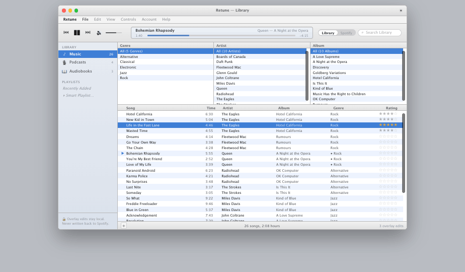

# Retune

Retune is a dense, album-first music library for macOS, inspired by the
three-column browser in early iTunes.

<picture>
  <source media="(prefers-color-scheme: dark)" srcset="screenshots/playing-dark.png">
  <source media="(prefers-color-scheme: light)" srcset="screenshots/playing-light.png">
  
</picture>

[See all screenshots](screenshots/)

Retune brings local audio files and a Spotify library into one browser while
keeping ratings, normalized genres, play counts, and other personal metadata
local.

## Why Retune?

Retune is for people who want to maintain a music library, not just stream one.

* Browse by genre, artist, and album in a compact, resizable interface.
* Mix local files and Spotify content without treating either as secondary.
* Edit personal metadata without rewriting Spotify's catalog.
* Rate albums and tracks, track plays, search, and manage owned playlists.
* Back up, restore, or merge the library as JSON or gzip.

## Run from source

Retune currently targets macOS. Building it requires:

* Rust stable
* Node.js 22 and npm
* Xcode command-line tools

```sh
cd apps/desktop
npm ci
npm exec tauri dev
```

On first launch, import local audio files, connect Spotify, or use both. Local
files remain available without a Spotify account. Spotify features require a
Spotify Premium account and a Spotify application client ID.

See [Development](docs/DEVELOPMENT.md) for Spotify setup, validation, packaging,
and troubleshooting.

## How Retune treats your library

Retune stores ratings, genres, play counts, and other overlay edits locally.
Those edits are never written to Spotify. Explicit content actions such as
saving albums, following artists, and editing owned playlists do update
Spotify.

Built-in Spotify playback does not require the Spotify desktop app. The desktop
app is needed only when using the optional Spotify Connect backend.

Spotify does not expose playlist contents to Retune unless the current user owns
the playlist. Retune can retain cached metadata and track counts for other
playlists, but cannot load or edit their tracks.

## Documentation

* [Architecture map](ARCHITECTURE.md)
* [Library domain](docs/architecture/library.md)
* [Spotify integration](docs/architecture/spotify.md)
* [Playback](docs/architecture/playback.md)
* [Persistence](docs/architecture/persistence.md)
* [Development and validation](docs/DEVELOPMENT.md)

## License

[MIT](LICENSE)
