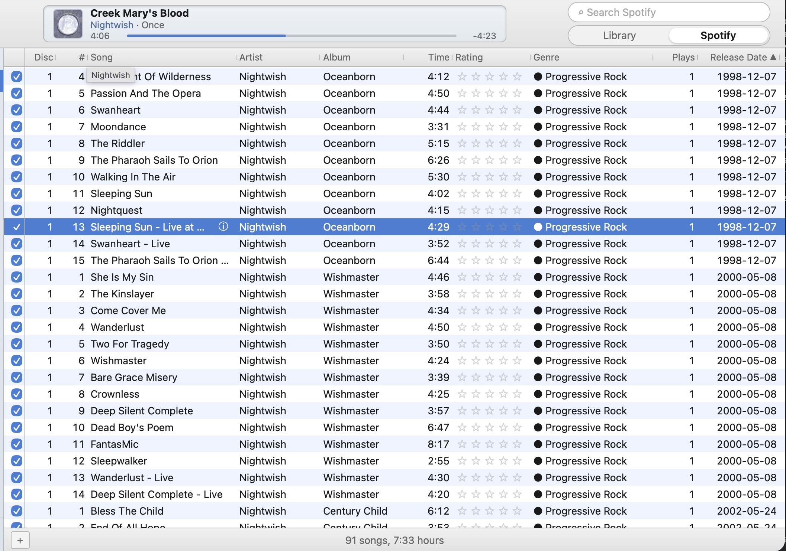
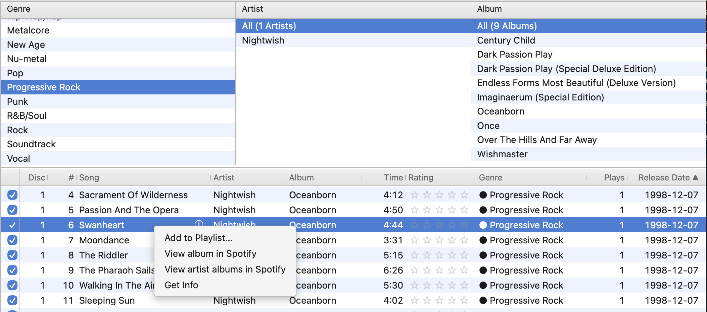
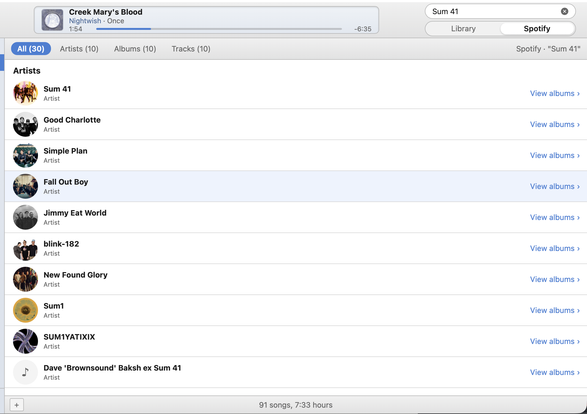
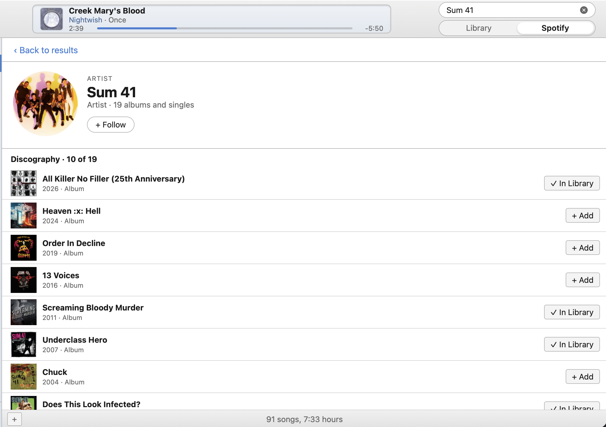
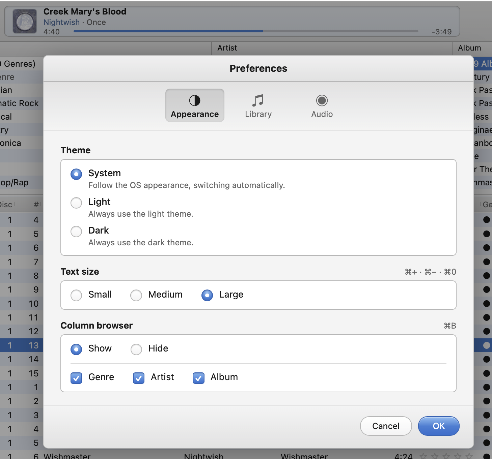
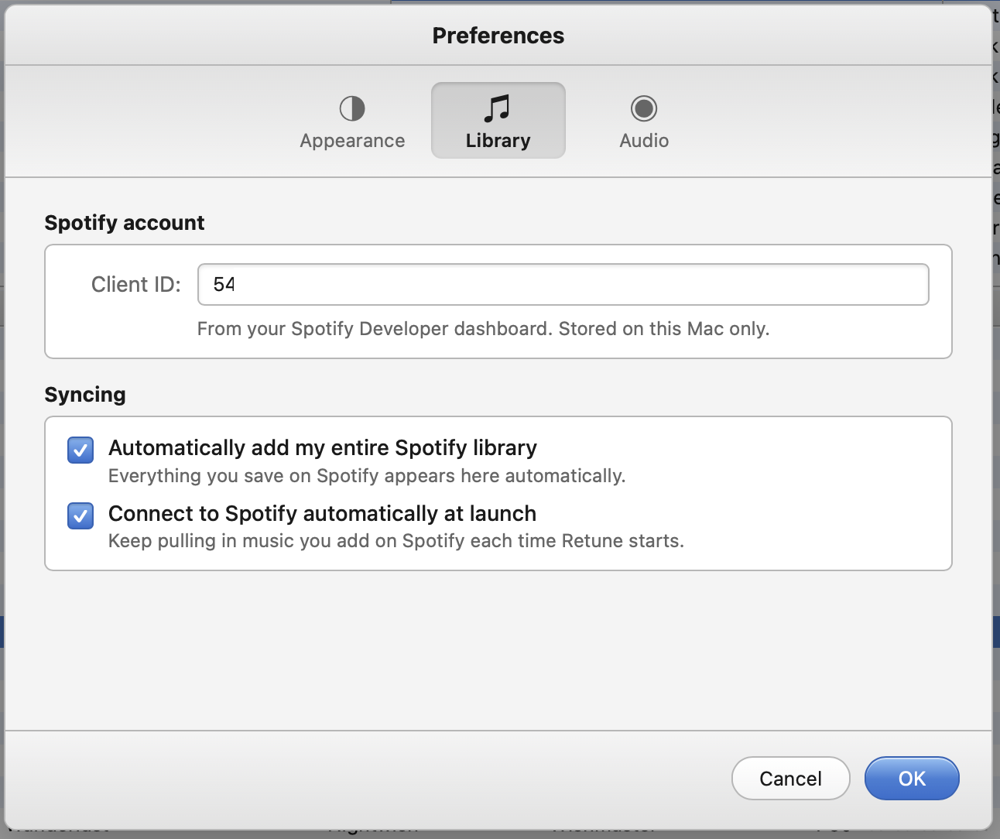
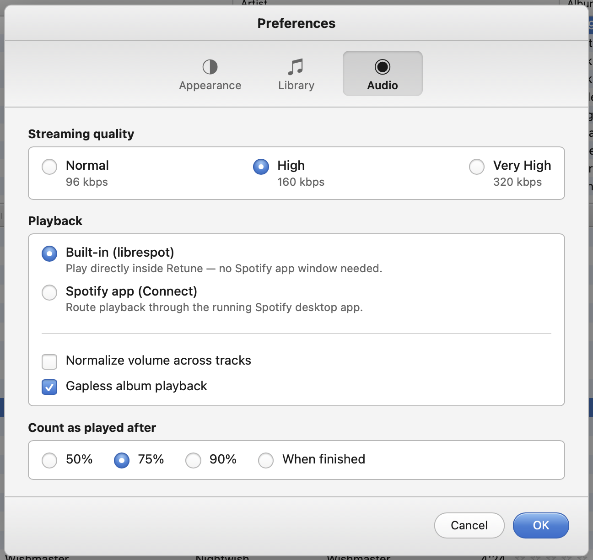

# Retune screenshots

Actual captures of Retune running on macOS.

[Back to Retune](../README.md)

## Library and playback

| Light | Dark |
| :---: | :---: |
|  |  |

## Browsing and track actions

| Track browser | Track actions |
| :---: | :---: |
|  |  |

## Spotify discovery

| Search results | Artist discography |
| :---: | :---: |
|  |  |

## Preferences

| Appearance | Library | Audio |
| :---: | :---: | :---: |
|  |  |  |
